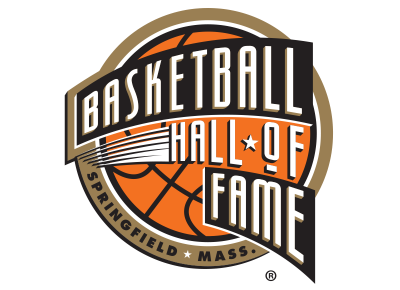
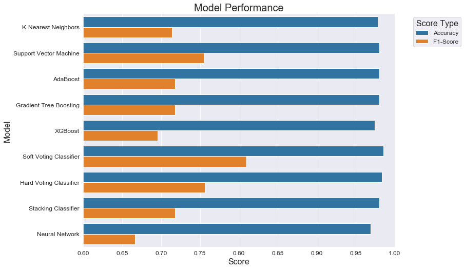

# NBA Hall-of-Fame Predictor

This project develops a model that predicts whether or not an NBA player has been inducted into the basketball hall of fame. Ultimately, the final model's classification succeeds with **99% accuracy and an 81% f1-score**.

## Project Overview

Generally, the holy grail of basketball is being inducted into the hall of fame. Many NBA players strive to reach the hall of fame in an effort to accompany the established basketball legends. However, to the average basketball fan, the criteria for reaching the hall of fame is hazy.

My idea for this project is to produce reliable predictions for hall-of-fame inductions using data science and machine learning. I have employed numerous advanced analysis and modeling techniques to ensure high, balanced accuracy. The final results of my models are displayed below.

Notice that the soft voting classifier performed at 99% accuracy with an 81% f1-score on the stratified test data. Hence, I have selected the soft voting classifier to be my final model. It ensembles the following eight high-performing models:

1. Tuned logistic regression with tuned bagging

2. Tuned k-nearest neighbors with tuned bagging

3. Tuned random forest

4. Tuned support vector machine with tuned bagging

5. Naive Bayes with tuned bagging

6. AdaBoost

7. Tuned gradient tree boosting

8. Tuned XGBoost

Currently, the most reputable HOF predictor on the internet is made by Basketball Reference. From the information publicly available, I have determined that Basketball Reference's model boasts a recall score of roughly 75%. My final model actually **outperformed this metric on completely unseen, randomized test data**.

- [Basketball Reference's predictions](https://www.basketball-reference.com/leaders/hof_prob.html)

- [Basketball Reference's predictive methodology](https://www.basketball-reference.com/about/hof_prob.html)

While it is not certain that my model usually performs better than Basketball Reference's model, I believe that the likelihood is fairly high. Nevertheless, my primary intention is only to create a model that is on par with the best model on the internet, which I certainly achieved.

As I have stated in the last Jupyter Notebook, my project still has plenty of room for improvement at each step of the process. In the future, I would not only like to raise the performance scores but to also gather insight into which features are the most critical. Hopefully, I can help basketball fans gain a greater understanding of "what it takes" for an NBA player to reach the hall of fame.

## Data Sources

All of the data used in this project is sourced from Kaggle.

- [Statistics data](https://www.kaggle.com/drgilermo/nba-players-stats)

- [Player information data](https://www.kaggle.com/open-source-sports/mens-professional-basketball)

## Software and Libraries Used

- Python 3 Jupyter Notebooks

- NumPy

- Pandas

- Matplotlib

- Seaborn

- Scikit-learn

- Joblib

- XGBoost

- TensorFlow/Keras

## Notebook Table of Contents

More information about my thought process throughout this project can be found in the five Jupyter Notebooks. I have provided **detailed inline comments** so that my workflow and analysis are both clear and understandable.

1. Data Collection and Initial Cleaning

    - 1.1. Data Collection Explained
    - 1.2. Imports
    - 1.3. Dropping Blank Statistical Columns
    - 1.4. Creating Career Statistics
    - 1.5. Gauging Statistical Nulls
    - 1.6. Saving Aggregated Statistical Data Frame
    - 1.7. Further Steps

2. Feature Engineering and Data Merging

    - 2.1. Imports
    - 2.2. Feature Engineering - Coach Awards
    - 2.3. Feature Engineering - Player Awards
    - 2.4. Feature Engineering - Coaches
    - 2.5. Feature Engineering - Draft
    - 2.6. Feature Engineering - Hall of Fame
    - 2.7. Feature Engineering - General Information
    - 2.8. Feature Engineering - All-Star Appearances
    - 2.9. Feature Engineering - Playoff Performance
    - 2.10. Merging All Data Frames
    - 2.11. Separating Retired and Non-Retired Players
    - 2.12. Saving Pre-Cleaned Data Frames
    - 2.13. Further Steps

3. Exploratory Data Analaysis and Preprocessing

    - 3.1. Imports
    - 3.2. Final Cleaning - Filling Null Values
    - 3.3. Final Cleaning - Correct Column Types
    - 3.4. Final Cleaning - Investigating and Removing Statistical Nulls
    - 3.5. Final Cleaning - Removing Outliers
    - 3.6. Generating Dummy Variables
    - 3.7. Detecting Multicollinearity
    - 3.8. Saving Cleaned Data Frame
    - 3.9. Preprocessing - Scaling Determination
    - 3.10. Stratified Train-Test Split and Scaling
    - 3.11. Overcoming Multicollinearity - Principal Component Analysis
    - 3.12. Selecting Number of Principal Components
    - 3.13. Dropping Principal Components
    - 3.14. Saving Test Indices
    - 3.15. Saving Scalers
    - 3.16. Saving Preprocessed Data Frames
    - 3.17. Potential Modifications

4. Modeling and Hyperparameter Tuning

    - 4.1. Imports
    - 4.2. Train and Validation Split
    - 4.3. Basic Modeling
    - 4.4. Basic Modeling - Hyperparameter Tuning
    - 4.5. Advanced Modeling - Ensemble Methods
    - 4.6. Advanced Modeling - Hyperparameter Tuning
    - 4.7. Ensembling Models
    - 4.8. Neural Network Modeling - Base Model
    - 4.9. Neural Network Modeling - Hyperparameter Tuning
    - 4.10. Neural Network MOdeling - Final Model
    - 4.11. Saving Models
    - 4.12. Further Steps

5. Testing Evaluation and Conclusions

    - 5.1. Imports
    - 5.2. Model Evaluation on Test Data
    - 5.3. Visualizing Model Performance
    - 5.4. Saving Final Model
    - 5.5. Reflections
    - 5.6. Saving Test Data Frame with Predictions
    - 5.7. Comparisons and Extensions
    - 5.8. Future Improvements - Comprehensive List
    - 5.9. Last Remarks
